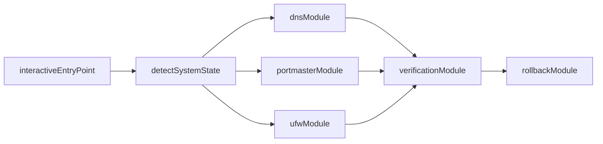

# Architecture

## Goals

The toolkit separates DNS, Portmaster, firewalling, verification, and rollback into small shell modules so public users can apply only the layers they want.

## High-Level Flow

## Design Rules

- Never commit live machine configs.
- Prompt for provider-specific secrets such as a NextDNS profile ID at runtime.
- Record local backups before changing `DNS`, `Portmaster`, or `UFW`.
- Prefer compatible configurations over maximal blocking when two tools would conflict.

## DNS Layer

There are two supported patterns:

1. `systemd-resolved` with DNS-over-TLS for providers like Quad9, AdGuard, and Cloudflare.
2. `NextDNS` CLI for encrypted DNS-over-HTTPS with a user-supplied profile ID.

## Portmaster Layer

Portmaster is treated as a privacy and connection-policy layer, not as the only DNS authority in every setup.

The toolkit specifically avoids blindly enabling `preventBypassing` when it detects a localhost encrypted DNS client, because that architecture can break.

## Firewall Layer

`UFW` is used for IP and port policy only.

- Default profile posture: `deny outgoing`
- Core DNS bypass guard: deny outbound `53` and `853`
- Domain-scale blocking is intentionally left to DNS providers and Portmaster lists

## Rollback Model

Each module can write a local manifest in `.runtime/state/` describing the files it backed up. Rollback restores those files directly from the manifest.
