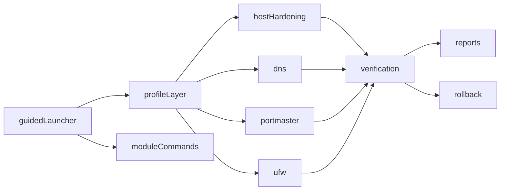

# Architecture

## Goals

V2 turns the toolkit into a shell-only platform with two entry styles:

- guided workflows for beginners
- direct module commands for power users

## High-Level Flow

## Design Rules

- Never commit live machine configs.
- Prompt for provider-specific secrets such as a NextDNS profile ID at runtime.
- Record local backups before changing managed files.
- Prefer compatible configurations over maximal blocking when two tools would conflict.
- Keep flows Debian-family friendly and shell-only.
- Make every profile reusable through the same module functions used by guided mode.

## Entry Layer

`bin/linux-extra-security` handles:

- global flags such as `--dry-run` and `--yes`
- guided workflows like `maximum-privacy`
- direct subcommands like `dns status` and `rollback list`
- profile planning and applying

## Profile Layer

Profiles live in `profiles/*.env` and declare:

- DNS provider and mode
- Portmaster preset
- UFW profile
- telemetry, SSH, updates, AppArmor, fail2ban, services, journald, sysctl, and browser posture values

Guided mode and direct `profile apply` both route through the same module implementations.

## Network Modules

### DNS

Supported patterns:

1. `systemd-resolved` with DNS-over-TLS for Quad9, AdGuard, and Cloudflare
2. `nextdns` CLI in `system-stub` or `local-forwarder` mode
3. custom `systemd-resolved` values for advanced users

### Portmaster

Portmaster is treated as a privacy policy layer, not as an always-authoritative DNS owner.

The toolkit avoids forcing `preventBypassing` when it detects:

- a localhost NextDNS forwarder
- an active VPN that may already own DNS routing

### Firewall

`UFW` stays the firewall abstraction.

- default posture: deny incoming plus deny outgoing
- loopback is always preserved
- DNS bypass protection is handled with outbound `53` and `853` policy where appropriate
- domain blocking remains the job of DNS providers and Portmaster lists

## Rollback Model

Each module writes its own local manifest in `.runtime/state/` when it changes files. Rollback can:

- list rollback points
- preview a manifest
- restore the latest manifest for a specific module
- restore the latest manifest overall through guided mode
